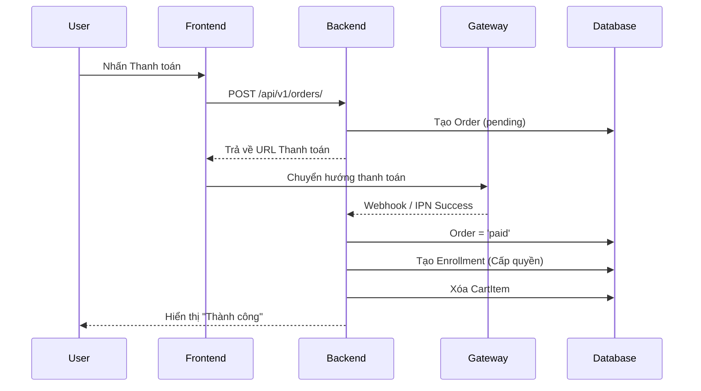

# Hệ Thống EduVNU - Tài Liệu Luồng Nghiệp Vụ & Kiến Trúc

Tài liệu này mô tả chi tiết cách các thành phần của EduVNU (EduHub) tương tác với nhau, phục vụ việc vẽ sơ đồ hệ thống (System Architecture/Sequence Diagrams).

---

## 1. Tổng Quan Kiến Trúc (Architecture Overview)

Hệ thống được xây dựng theo mô hình **Client-Server** giao tiếp qua RESTful API.

*   **Frontend**: React.js (Vite), Vanilla CSS, Axios.
*   **Backend**: Django REST Framework (DRF).
*   **Database**: MS SQL Server (Hệ thống chính), Redis (Caching & Buffer).
*   **Background Jobs**: Celery + Celery Beat (Xử lý các tác vụ nặng: Gửi mail, Tính toán thống kê, Flush buffer).
*   **Gateway**: SePay / VNPAY (Thanh toán).

---

## 2. Các Luồng Nghiệp Vụ Chính (Core Business Flows)

### A. Luồng Đăng Ký & Thanh Toán (Enrollment & Payment)
Đây là luồng phức tạp nhất, đảm bảo tính nhất quán của giao dịch.

1.  **Selection**: User thêm khóa học vào `Cart` (Lưu ở Database `CartItem`).
2.  **Checkout**: User nhấn thanh toán → Backend tạo `Order` với status `pending`.
3.  **Gateway**: User được chuyển hướng sang cổng thanh toán (VNPAY/SePay).
    *   *Lưu ý*: Không xóa Cart ở bước này.
4.  **Verification (IPN/Webhook)**: Cổng thanh toán gửi tín hiệu xác nhận về `/api/v1/orders/webhook/`.
5.  **Completion**:
    *   Cập nhật `Order.status = 'paid'`.
    *   Tự động giải phóng (xóa) các `CartItem` liên quan.
    *   Tạo bản ghi `Enrollment` (Cấp quyền vào học cho User).
    *   Cộng doanh thu vào `InstructorWallet` (Ledger Transaction).
    *   Gửi `Notification` cho cả User (Mua thành công) và Giảng viên (Có học viên mới).

### B. Luồng Học Tập & Theo Dõi Tiến Độ (Learning & Heartbeat)
Sử dụng cơ chế Buffer để tối ưu hiệu suất ghi DB.

1.  **Watch**: User xem video bài giảng (YouTube Iframe).
2.  **Heartbeat**: Mỗi 30s-60s, Frontend gửi một request `POST /heartbeat/` kèm số giây đã xem.
3.  **Buffering**: Backend nhận dữ liệu → Ghi vào **Redis/RAM Buffer** (không ghi thẳng vào SQL Server để tránh overload).
4.  **Sync**: Một tác vụ **Celery Worker** chạy ngầm định kỳ (mỗi 5p) quét RAM → Tổng hợp (Aggregate) → Cập nhật vào bảng `UserProgress` (trường `time_spent` và `status`).
5.  **Completion**: Khi tổng số bài học đã hoàn thành = 100% → Cho phép User tải `Certificate` (PDF có QR Code).

### C. Luồng Giảng Viên (Instructor Management)
Quản lý vòng đời nội dung và tài chính.

1.  **Content Creation**: Giảng viên tạo Course → Chapter → Lesson.
2.  **Moderation**: Giảng viên gửi yêu cầu `Submit for Review`.
3.  **Approval**: Admin kiểm duyệt qua Admin Dashboard → `Approve` → Khóa học chuyển trạng thái `published`.
4.  **Analytics**: Giảng viên xem Dashboard: 
    *   Backend sử dụng `SQL Aggregates` (Sum/Count) để tính toán từ bảng `Enrollment` và `OrderItem`.
    *   Dữ liệu thời gian thực được lấy từ sự kết hợp giữa DB và Heartbeat Buffer.
5.  **Finance**: Giảng viên yêu cầu `Withdraw` → Hệ thống kiểm tra số dư trong `InstructorWallet` → Tạo lệnh rút tiền.

---

## 3. Luồng Dữ Liệu Kỹ Thuật (Technical Data Flow)

### Hệ Thống Thông Báo (Notification System)
Mọi Action quan trọng (Event-driven) đều kích hoạt Notification:
`Event (Order/Review/Approve)` → `Notification Model` → `API get_notifications` → `Frontend Bell Header`.

### Kiểm Thực Chứng Chỉ (Certificate Verification)
1.  **QR Scan**: User quét mã trên bằng PDF.
2.  **Redirect**: Chuyển đến trang Verify công khai.
3.  **Rate Limit**: Backend áp dụng `AnonRateThrottle` để tránh robot quét UUID chứng chỉ.
4.  **Validation**: Truy vấn SQL Server kiểm tra mã có tồn tại và đúng User không.

---

## 4. Gợi Ý Sơ Đồ Mermaid (Sơ đồ Sequence Thanh toán)

---

## 5. Các Thực Thể Chính (Core Entities)
Cần lưu ý khi vẽ sơ đồ ERD:
*   **User**: (is_student, is_instructor).
*   **Course**: (status: draft/pending/published/rejected).
*   **Enrollment**: Mối quan hệ Many-to-Many giữa User và Course.
*   **InstructorWallet**: Lưu số dư và thông tin ngân hàng.
*   **WalletTransaction**: Nhật ký biến động số dư (Ledger).
*   **UserProgress**: Lưu vết thời gian học chi tiết từng giây.
